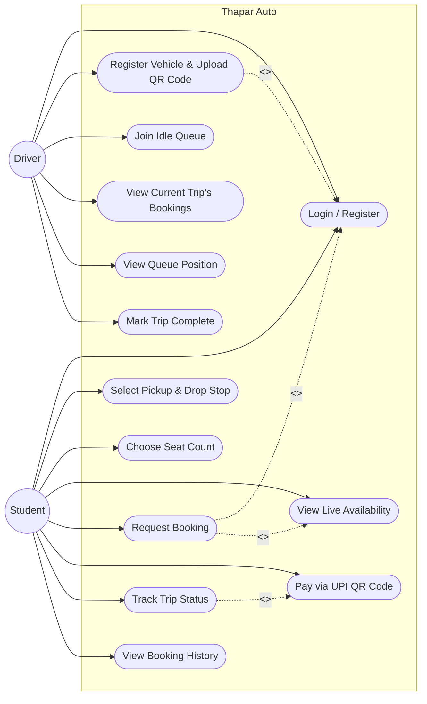
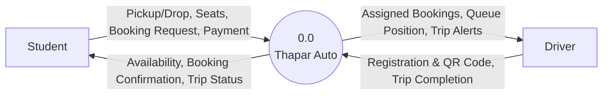

# Thapar Auto — System Design Diagrams

This document contains the foundational system design diagrams for **Thapar Auto**, a shared campus auto-rickshaw booking and pooling app built with a Flutter frontend and a Node.js/Express + SQLite backend.

The diagrams are written in [Mermaid](https://mermaid.js.org/), which can be natively rendered in GitHub, Notion, or exported as images using the [Mermaid Live Editor](https://mermaid.live).

## 1. Use-Case Diagram

This diagram maps out the primary actors (Student and Driver) and the actions each can perform within the system. A Student books seats on a pooled or newly-dispatched auto and pays via UPI QR; a Driver registers their vehicle, joins the idle queue, and manages an active trip.



---

## 2. Data Flow Diagrams (DFDs)

### Level 0 DFD (Context Diagram)

The Level 0 DFD shows Thapar Auto as a single, high-level process interacting with the two external entities: Student and Driver.



### Level 1 DFD (System Breakdown)

The Level 1 DFD breaks the single Thapar Auto node into its core functional modules: Registration, Availability & Matching, Booking & Payment, and Trip & Queue Management.

```mermaid
flowchart TD
    %% Entities
    Student[Student]
    Driver[Driver]

    %% Processes
    P1(("1.0<br/>Registration"))
    P2(("2.0<br/>Availability & Matching"))
    P3(("3.0<br/>Booking & Payment"))
    P4(("4.0<br/>Trip & Queue Management"))

    %% Data Stores
    DB_Users[(D1: Students & Drivers DB)]
    DB_Loc[(D2: Locations DB)]
    DB_Autos[(D3: Autos DB)]
    DB_Bookings[(D4: Bookings DB)]

    %% Student Interactions
    Student -->|Name, Email| P1
    Student -->|Pickup, Drop, Seats| P2
    P2 -->|Poolable/Idle Options| Student
    Student -->|Booking Request, Payment| P3
    P3 -->|Confirmation, Fare| Student
    Student -->|Track Trip| P4
    P4 -->|Trip Status| Student

    %% Driver Interactions
    Driver -->|Name, Phone, Capacity, QR Code| P1
    P1 -->|Registered Auto (idle)| Driver
    Driver -->|Complete Trip| P4
    P4 -->|Queue Position, Trip Bookings| Driver

    %% Internal Data Flows (Process to DB)
    P1 <-->|Read/Write Profile| DB_Users
    P1 <-->|Create Auto Record| DB_Autos
    P2 <-->|Read Stops & Order| DB_Loc
    P2 <-->|Read Auto Status & Route| DB_Autos
    P3 <-->|Read/Write Booking, Update Seats| DB_Bookings
    P3 <-->|Update Seats Booked| DB_Autos
    P4 <-->|Update Status, Queue Position| DB_Autos
    P4 <-->|Read Bookings for Auto| DB_Bookings
```

### Level 2 DFD (Decomposition of "Booking & Payment")

This diagram zooms in on Process `3.0 Booking & Payment` to show the exact flow of data when a student requests a seat: the system first tries to pool the request onto an already-enroute auto heading the same direction, and falls back to dispatching the next idle auto from the queue.

```mermaid
flowchart TD
    %% Entities
    Student[Student]
    Driver[Driver]

    %% Sub-Processes
    P3_1(("3.1<br/>Find Poolable Auto"))
    P3_2(("3.2<br/>Dispatch from Idle Queue"))
    P3_3(("3.3<br/>Create Booking Record"))
    P3_4(("3.4<br/>Confirm UPI Payment"))

    %% Data Stores
    DB_Autos[(D3: Autos DB)]
    DB_Bookings[(D4: Bookings DB)]

    %% Booking Request Flow
    Student -->|Pickup, Drop, Seats| P3_1
    P3_1 <-->|Check Direction, Route, Capacity| DB_Autos

    P3_1 -->|No Match Found| P3_2
    P3_2 <-->|Pop Next Idle Auto| DB_Autos
    P3_2 -->|Set Enroute, Route Span| DB_Autos

    P3_1 -->|Match Found| P3_3
    P3_2 -->|Auto Assigned| P3_3
    P3_3 -->|Update Seats Booked| DB_Autos
    P3_3 -->|Save Booking (PENDING)| DB_Bookings
    P3_3 -->|Booking + Fare| Student

    %% Payment Flow
    Student -->|Scan QR, Pay via UPI| P3_4
    P3_4 -->|Mark PAID| DB_Bookings
    P3_4 -->|Payment Confirmed| Student

    %% Driver-side visibility
    DB_Bookings -->|Bookings for Auto| Driver
    DB_Autos -->|Queue Position| Driver
```
